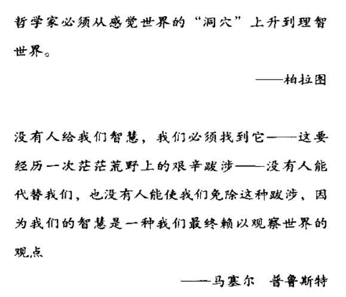

ISBN 7-80197-363-1/F.364

## 前瞻

中国期货业协会，说不定未来我也要考一个期货从业人员资格考试呢！

[期货从业人员资格考试介绍页面](http://www.cfachina.org/servicesupport/examination/qualificationexamination/)

## 语料

——一个成功的交易者，必须要有大智慧，同时还要战胜*恐惧与贪婪*。

——

### 前言

> 作者真得很爱哲学啊

### 第二章 一个与众不同的赌徒

——根据我对中国股市的认识，我做股票有三条基本原则：

——①用政治的眼光来审视股票市场，抓住市场可能出现的重大变化。具体说，就是根据市场对政策的反应强度来决定，是否应该大胆出击。股票的内在价值或者市场价格的高低，并不是最重要的。

——②抓住大行情可能来临的机会，重仓交易，操作时干净利落，绝不拖泥带水。不贪图小利，迷恋股市，整天在市场中炒来炒去。

——③绝不染指垃圾股，这样，即使暂时被套住，也有翻身的时候，当然，碰巧碰上了像银广夏这样的大骗子，只能自认倒霉。

### 第四章 绝处逢生

[327事件](https://new.qq.com/omn/20210326/20210326A0ELI300.html#:~:text=%E2%80%9C327%E4%BA%8B%E4%BB%B6%E2%80%9D%E5%89%8D%E6%83%85,1995%E5%B9%B42%E6%9C%8823%E6%97%A5%EF%BC%8C%E4%B8%8A%E6%B5%B7%E8%AF%81%E5%88%B8%E4%BA%A4%E6%98%93%E6%89%80%E5%8F%91%E7%94%9F%E4%BA%86%E9%9C%87%E6%83%8A%E4%B8%AD%E5%A4%96%E7%9A%84%E2%80%9C327%E2%80%9D%E5%9B%BD%E5%80%BA%E4%BA%8B%E4%BB%B6%EF%BC%8C%E5%BD%93%E4%BA%8B%E4%BA%BA%E4%B9%8B%E4%B8%80%E7%9A%84%E7%AE%A1%E9%87%91%E7%94%9F%E7%94%B1%E6%AD%A4%E8%BA%AB%E9%99%B7%E7%89%A2%E7%8B%B1%EF%BC%8C%E5%8F%A6%E4%B8%80%E5%BD%93%E4%BA%8B%E4%BA%BA%E5%B0%89%E6%96%87%E6%B8%8A%E8%A2%AB%E5%85%8D%E6%8E%89%E4%B8%8A%E4%BA%A4%E6%89%80%E6%80%BB%E7%BB%8F%E7%90%86%E7%9A%84%E8%81%8C%E5%8A%A1%E3%80%82)

### 第五章 苦闷的求索

> 看到这里，才明白为什么作者在前言会大肆使用哲学似的话语描述自己的操盘。显然，在327事件之后，他仿佛陷入了巨大的空洞(cavity)，就像置于垂在腰间的细绳之下，钟摆一样垂荡。

### 第六章 纸上富贵一场梦

——我们渴望的事情不可能发生，或者即将发生，也不在恰当的时间和地点。总之，永远不会令我们感到幸福。

### 第七章 单纯与复杂

——拯救灵魂的唯一方法是禁欲、牺牲及对简单和朴素毫不动摇的坚持。

——投机者的市场认识、交易理念、心理素质、策略技巧、修养境界等因素，比起市场预测能力来，对最后的成败所起的作用更大。

——一旦你在市场中建立了头寸，你对市场走势的判断就不像原来作为旁观者时那么客观、超然、自信，你的心情绪会发生巨大的变化，怀疑，焦虑，恐惧、患得患失等主观因素很可能扭曲你的思维，使你在实际操作时陷入混乱——反复无自相矛盾，等等。结果，看起来一次很单纯的顺势交易，在人的心理因素的干扰下，你会把它搞得乱七八糟。事后看来，你当初对市场走势的判断完全准确，但是，很可能你非但没有从自己的聪明的判断中赚到钱，还有可能亏钱。

——短线交易的策略使我控制不住内心的贪婪和恐惧，也抵挡不住市场的诱惑。

——如果投机者入市之后三天还没有出现利润，立刻平仓出场。

——淡泊的心态使我的思维单纯、清晰，容易和市场运动的节奏合拍，没有巨大的冲突。.

——中长线交易是期货赚大钱的最佳策略。

——加码操作，初投之后符合预期就一次一次的加码。

### 第八章 兵败苏州红小豆

### 第九章 与天为敌

——在期货交易中，一个人的心理、精神状态远比他拥有的市场知识和预测技术重要的多。

> 精神状态，一次失败之后就是恐惧、害怕、焦虑等等消极因素动摇人的交易信念。
>
> 假如王阳明先生用他那种光风霁月般的心胸来炒股、期货交易，一切会变的怎么样呢？
>
> 首先，我们假定阳明先生不会断然拒绝，说赌博害人什么的，或者说，我们要给他一个不能拒绝的理由 :ok_hand:
>
> 先生会怎么想呢？
>
> 他可能会用当年格竹子的精神去钻研，实战练手，关注国家大势，政策方针，努力学习科学文化知识，最终说不定会成为文史哲学圈里的巴菲特呢。

[头寸](https://zhuanlan.zhihu.com/p/57376889)

——那是一股什么样的气呢？一股倔强之气，一股不被市场、不被自我击倒之气。

——我主要还是着眼于限制亏损，而不是牟取暴利。

### 第十章 激战海南咖啡

——分析家似乎是在投机的钢琴上和幸运女神一起弹奏一曲二重奏，而所有的调子都是由善变之神确定的。

> 读这本书，很想读武侠故事，全是很爽的感觉，而且文风明显是零几年的，读起来真是古风扑面。
>
> 而且，作者加入了太多的个人感情色彩，主观情绪很浓，就像奶茶咖啡混入半两黄土。
>
> 其实读起来也就是读个意思，真实参与期货交易，从这个却是读不出来。各种曲线的鉴别分析我觉得是最基础的部分，然后就是历史行情的收集，快速浏览，结合行业政策，产业报告等进行练手，最后是真真正正的上手实战，成为一个专业的投机者，并日以继夜的重复。

——能否抵御市场短期波动的威胁、欺骗，是顺势交易时最令人头痛而又不得不面对的现实问题。一个神经过敏、心理脆肉的投机者是不可能从长线交易中获取惊人利润的。

### 第十一章 逆势操作的反思

——你不可能靠风向标致富。

——基金经理们总是犯经验主义错误，以为历史会简单地重复，未来就是过去的再现。

——在市场交易中，投机者应该做出正确的决策，而不是做出让自己感觉舒服的决策。心理上很舒服的交易，结果往往不好。

—— ①在市场价格判断上，价格变化本身透露出的信息远比持仓量、成交量的意义重要。在早期的期货交易中，我曾经对此迷惑不解。为了预测市场价格的走势，把很多精力集中在分析持仓量、成交量的微妙变化上，钻牛角尖，误入歧途。

——②对一个投机者来说，不要参考市场中别人的行为，从众是通向地狱最廉价的门票。

——现代决策心理学的研究表明，当一个人的内心充满矛盾和冲突时，最典型的行为特征是不采取任何行动。

### 第十四章 杰西 里费斯.

——时代在前进，但每一个个人都在重新开始。

> 上面的话，多像现在的我啊！
>
> 对于，突如其来的负能量，我并不能很好地消化它，反而让它成为阻止我进一步学习的最重要的因素。痛苦啊，没有学神也写一本书《考研+编程牛B历程回忆录》，我觉得自己找不到支撑的力量，好在每一次的坚持都是有利的，耐久力度在不断地增大。

### 第十五章 我的两条短线交易经验

### 第十六章 离市场远一点

### 第十七章 投机者的修养、境界和市场交易

——当适当的气质与适当的智力结构相结合时，你就能得到理性的行为。

——市场交易就是简单的一买一卖，但在这一买一卖的背后，隐含着投机者不同的观念、意识、目的、动机，反映出投机者不同的价值观，市场交易理念、对待金钱的态度、对待风险的态度，等等。

——我平静、淡然地欣赏着市场的变化，也审视着自己的内心世界。我以我自己的方式理解这一切。

### 第十八章 你能摆脱地心引力吗？

> 这一章很有趣，政策市场淋漓展现。

### 第十九章 里费斯之死

——经过个人奋斗，我终于从一无所有转为极端贫困。

——期货市场是有经验的人获得更多经验，有金钱的人变得一无所有的地方。

### 结束语

人生到处知何似？应似飞鸿踏雪泥。泥上偶然留指抓，鸿飞那复计东西？

## 泛泛之谈

期货交易真是波澜壮阔啊！

此次阅读不比我当初看那本08年的程序员从业经历的书差，甚至还更加鞭辟入里。写者用丰富的经历和富有辩证色彩的向我展示了世纪之交那段岁月的酣畅淋漓。看得让人如痴如醉。

虽然，我也有写歪心思，但是目前我这个考研的情况，还是算了吧。兼职挣到的小两万块的钱现在就是一笔巨款。说不定未来我可以搞搞期货交易。

我对于台湾形势的判断很乐观，我觉得这两三年就会实现。这样的思想下，加入收复台湾可以得到什么呢？什么期货会受到影响呢？我觉得还不如买点军工类的股票划算。

目前，我的考研学习经历真得很难受，一次停下来就会出现颓丧的境地。现在看来，看书还是很舒服的，果然人不会脱离他的老本行。
